# <a name="preface"></a>서문

## <a name="foreword"></a>안내

저희 리디북스는 출판사 여러분께서 제작하여 주신 소중한 EPUB 파일을 서비스함에 있어서 자주 발생하는 이슈들을 정리하였습니다.

다른 여러 가지 사례들도 많이 있으나, 가장 빈번하게 발생하는 사례를 준비하였습니다.
귀사의 EPUB 파일 제작에 참고가 되셨으면 합니다.

## <a name="reference"></a>참고

글자수 1,000자 이하, 이미지가 많은 도서는 미리 보기를 지원하지 않습니다.
텍스트보다 이미지의 비중이 높은 경우 PDF 제작을 권장합니다.

# <a name="images"></a>이미지

## <a name="image-size"></a>이미지 크기

 권장 | 비권장
--------|--------
1080px 이상의 이미지를 넣어야 태블릿에서도 읽기 좋음<br>그 이상을 입력하더라도 뷰어에서 자동으로 사이즈 조절 됨 | 태블릿에서 읽기 어려움
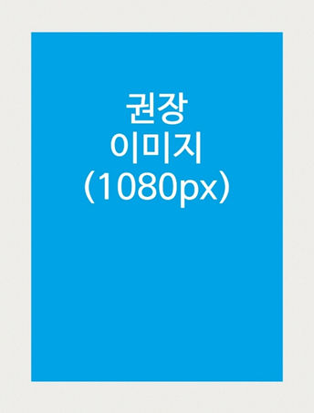 | 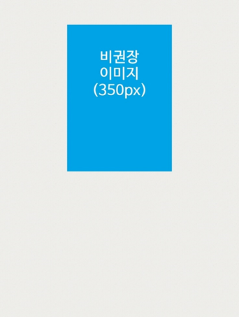 

## <a name="image-position"></a>이미지 배치

 정상 | 오류(text-indent 사용 금지)
--------|--------
\ | \<div style=**"text-indent:10em;"**>\\</div>`
 |  

## <a name="image-file-name"></a>이미지 파일명

 정상 | 오류
--------|--------
영어 및 숫자만 사용 | 한글 사용

## <a name="image-colorspace"></a>이미지 색상 모드

 정상 | 오류
--------|--------
RGB | CMYK

## <a name="image-format"></a>이미지 확장자

 정상 | 오류
--------|--------
\<이미지 파일 확장자> = \<HTML 내 이미지 확장자> | \<이미지 파일 확장자> ≠ \<HTML 내 이미지 확장자>

## <a name="image-tag"></a>이미지 태그

 정상 | 오류
--------|--------
img | svg, image

## <a name="image-refine-edge"></a>이미지 테두리선 따기 (누끼)

 정상 | 정상 | 오류
--------|--------|--------
배경색 대신 다른 색상의 이미지 사용 | 테두리선(stroke)을 따서 배경색과 이미지를 구분 | 뷰어 배경색 = 이미지 색상<br>(이미지가 구분되지 않음)
 |  |  

## <a name="font-size-in-image"></a>이미지 내 글자 크기

권장 글자 크기 : **14pt 이상**
(권장 글자 크기보다 작게 제작 시 가독성 저하)

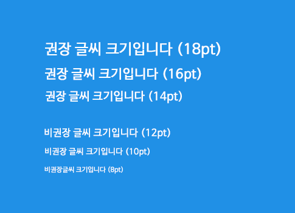 

# <a name="font"></a>폰트

## <a name="font-size"></a>폰트 크기

 권장 | 비권장
--------|--------
1.0em | 1.0em 미만<br>(1.0em 보다 작은 경우 기기에 따라 가독성 저하)
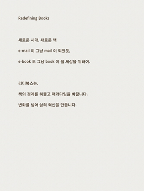 | 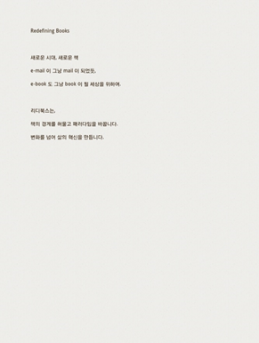 

## <a name="font-unit"></a>폰트 단위

단위는 **em** 또는 **%** (상대값)을 사용
**pt**, **px** (절대값) 사용 시, 뷰어에서 글자 크기 변경 불가

# <a name="html"></a>HTML(Spine)

## <a name="html-file-size"></a>HTML 파일 크기

/| 권장 | 비권장 | 비고
--------|--------|--------|--------
챕터, 섹션 | 모두 각각의 HTML로 분리 | | page-break 태그로 페이지를 나누지 말 것<br>(Android 3.0 이하는 지원 x)
파일 내 HTML 개수 | 최대 **250개** | |
HTML 하나 당 용량 | 권장 **150Kb**, 최대 **300Kb** | | 크기가 커질수록 페이지 로딩 시간 증가
파일구조 | 커버<br>  EPUB 파일의 맨 앞에 위치<br>  파일명 : cover.html | 파일명에 한글 비권장 |
파일구조 예시 | 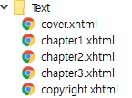 | 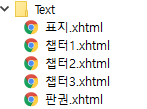 |

## <a name="html-layout"></a>페이지 구성

### 사례 1

- **한 화면에는 하나의 HTML(spine)만 보임**
- 모든 HTML(spine)은 뷰어 두 쪽 보기 시 **왼쪽**부터 시작함

 정상 케이스 | 오류 케이스
--------|--------
HTML에 이미지 함께 포함<br>→ 이미지가 이어져 보임 | HTML당 이미지 1장씩 포함
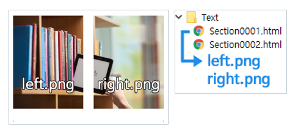 | 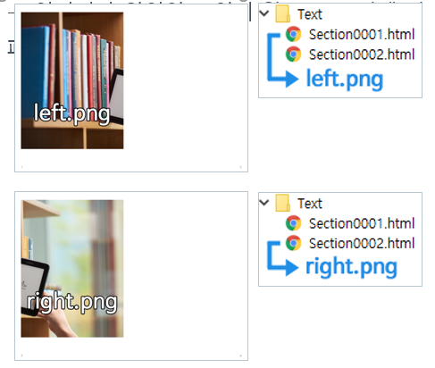 

### 사례 2

- **HTML 내 양면 이미지를 올바른 순서에 배치**
- 양면 연출의 시작 이미지를 HTML 내 홀수 번째에 배치하여 두 쪽 보기시 어긋나지 않게 함

 정상 케이스 | 정상 케이스 | 오류 케이스
--------|--------|--------
- 양면 연출을 기점으로 페이지를 분리<br>- 양면 연출의 시작 이미지(left.png)가 **홀수 번째(1st)에 위치**<br>- 두 쪽 보기 시 양면 이미지가 이어져 보임 | - 이전 페이지의 단면 이미지(000.png)를 양면 연출 앞으로 이동<br>- 양면 연출의 시작 이미지(left.png)가 **홀수 번째(3rd)에 위치**<br>- 두 쪽 보기 시 양면 이미지가 이어져 보임 | HTML 내 양면 이미지 배치 오류<br>→ 양면 연출이 어긋나 보임
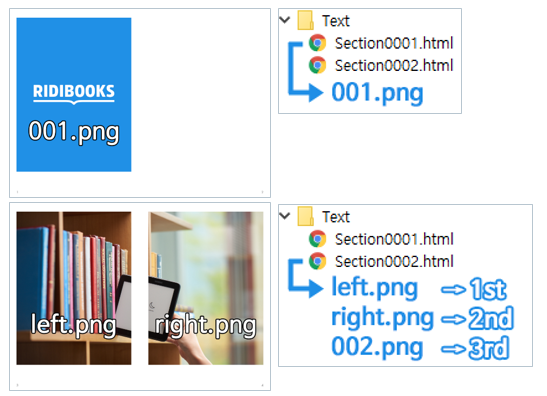 | 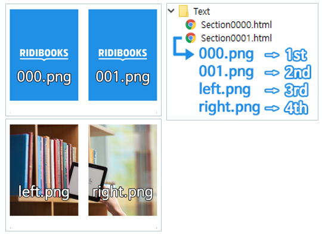 |  

## <a name="html-toc"></a>목차

### H 태그를 사용하는 방법(Sigil)

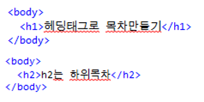

1. 각 html 섹션 본문에 **\<h>목차명\</h>** 입력 후 **Ctrl+T**(Generate Table of contents)
2. 자동으로 toc.ncx 내 목차 생성됨

### toc.ncx 내에서 목차 지정하는 방법

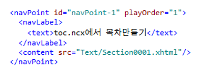

```xml
<navPoint id="navPoint-1" playOrder="1">
  <navLabel>
    <text>목차명</text>
  </navLabel>
  <content src="목차 위치" />
</navPoint>
```

1. 위 태그를 복사 후 toc.ncx에 붙여 넣기
2. 목차명 및 목차 위치 수정
3. toc.ncx 우클릭 후 **Renumber TOC Entries**

## <a name="html-footnote"></a>주석

### <a name="html-footnote-structure"></a>주석 기본 구조

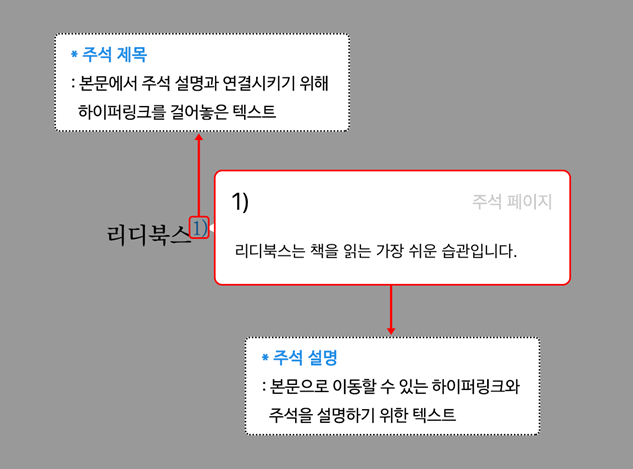

### <a name="html-footnote-html-structure"></a>주석 기본 HTML 구조

#### 주석 제목

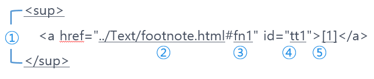

1. sup 태그 : 주석 제목 텍스트를 윗 첨자 형태로 만드는 태그
2. 주석 설명의 html 주소
3. 주석 설명의 ID
4. 주석 제목의 ID
5. 하이퍼링크가 적용되는 텍스트 : 클릭ㆍ터치 시 해당 주석 설명으로 이동 or 주석 설명 팝업

```
- 팝업 주석(제목)에 사용할 수 있는 기호 예시:  1   2]   3)   [4]   (5)   6.   7
- a 태그 사이에 한글이 포함된 경우, 뷰어에서 팝업 주석이 정상적으로 작동하지 않습니다.
```

#### 주석 설명

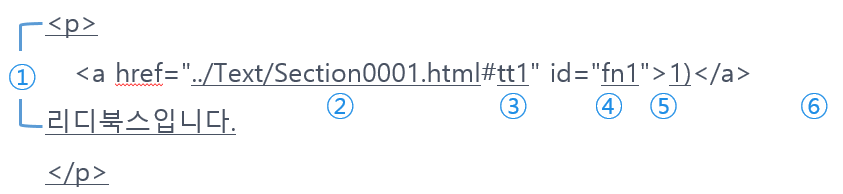

1. p 태그 : 주석 설명을 시작과 끝 부분을 인식하는 역할 (필수 사항)
2. 주석 제목의 html 주소
3. 주석 제목의 ID
4. 주석 설명의 ID
5. 하이퍼링크가 적용되는 텍스트 : 클릭ㆍ터치 시 해당 주석 제목으로 이동
6. 주석 설명 텍스트

```
- 팝업 주석(설명)에 사용할 수 있는 기호 예시:  1   2]   3)   [4]   (5)   6.
- a 태그 사이에 한글이 포함된 경우, 뷰어에서 팝업 주석이 정상적으로 작동하지 않습니다.
```

### <a name="html-footnote-title-ex"></a>주석 제목 HTML 예시

#### 일반적인 구조

```html
<sup>
  <a href="../Text/footnote.html#fn1" id="tt1">1)</a>
</sup>
```


#### sub, sup가 없는 형식

```html
<a href="../Text/footnote.html#fn2" id="tt2">[2]</a>
```

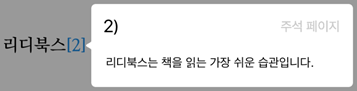

#### 일부가 태그로 감싸여있는 형식

```html
<a href="../Text/footnote.html#fn3" id="tt3">
  {3<span class="red">}</span>
</a>
```


#### 전체가 태그로 감싸여있는 형식

```html
<a href="../Text/footnote.html#fn4" id="tt4">
  <span class="red">4.</span>
</a>
```


### <a name="html-footnote-body-ex"></a>주석 설명 HTML 예시

#### 일반적인 구조

```html
<p>
  <a href="../Text/Section0001.html#tt1" id="fn1">1)</a>
  리디북스는 책을 읽는 가장 쉬운 습관입니다.
</p>
```


#### 일부가 태그로 감싸여있는 형식

```html
<p>
  <a href="../Text/Section0001.html#tt2" id="fn2">[2]</a>
  <span class="red">리디북스</span>는 책을 읽는 가장 쉬운 습관입니다.
</p>
```


#### 전체가 태그로 감싸여있는 형식

```html
<p>
  <a href="../Text/Section0001.html#tt3" id="fn3">{3}</a>
  <span class="red">리디북스는 책을 읽는 가장 쉬운 습관입니다.</span>
</p>
```


#### 링크가 태그로 감싸여있는 형식

```html
<p>
  <span class="italic">
    <a href="../Text/Section0001.html#tt4" id="fn4">4)</a>
  </span>
  리디북스는 책을 읽는 가장 쉬운 습관입니다.
</p>
```


#### 여러 문단으로 구성되어있는 형식

```html
<p>
  <a href="../Text/Section0001.html#tt5" id="fn5">5.</a>
  전자책 서비스, 리디북스<br/>
  리디북스는 책을 읽는 가장 쉬운 습관입니다.
</p>
```

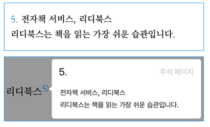

# <a name="epub-test"></a>ePub 테스트

## <a name="epub-validation-by-sigil"></a>유효성 검사 - Sigil

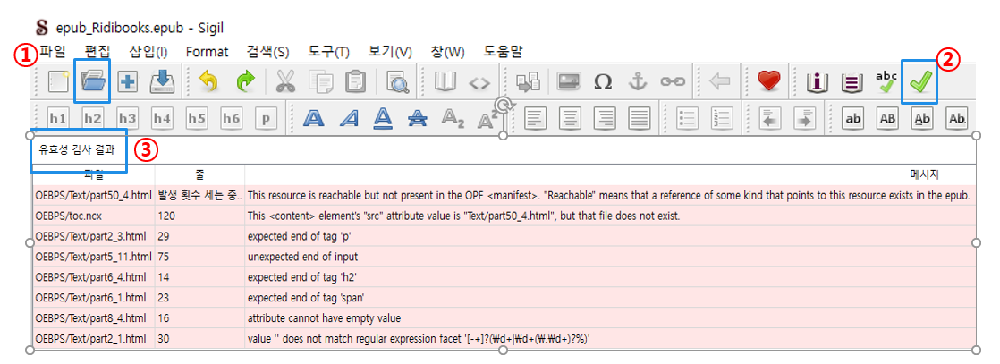

1. Sigil을 설치하고 테스트할 ePub 파일 열기 (단축키 Ctrl+O)
2. ePub 유효성 테스트를 클릭 (단축키 Alt+F2)
3. 유효성 검사 결과를 확인 후 오류 수정 (결과 클릭 시 오류 페이지로 이동)

## <a name="epub-test-by-app"></a> 파일보기 - 리디북스 뷰어

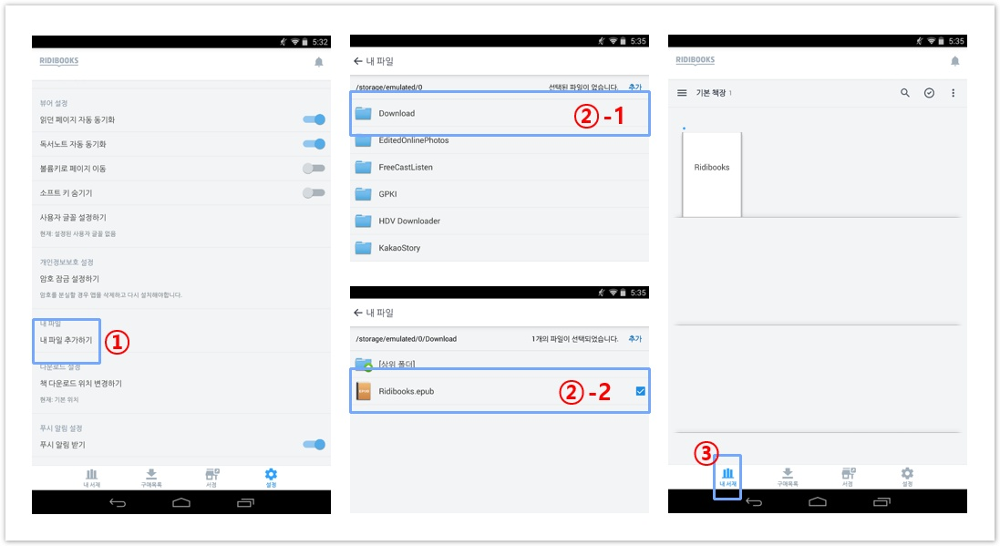

1. 기기에 검수할 EPUB 파일 추가 (\*Android만 가능)
2. 리디북스 앱 실행 → 설정 → 내 파일 추가하기 → 검수할 EPUB 파일 선택
3. 내 서재에서 다운로드한 EPUB 파일 검수 진행
