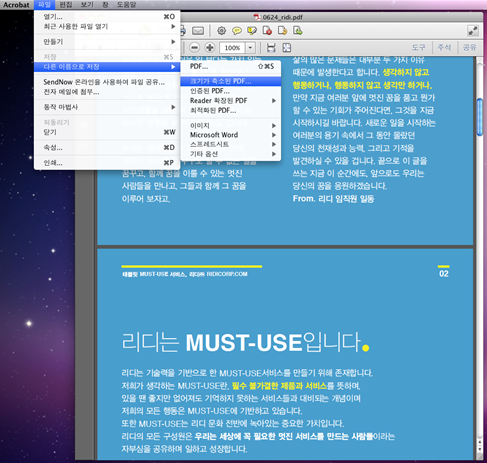
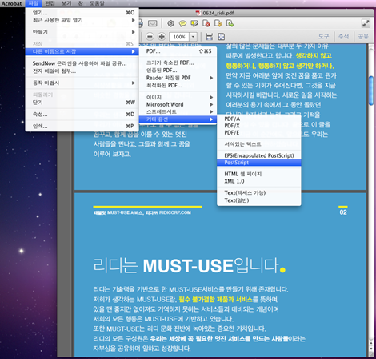
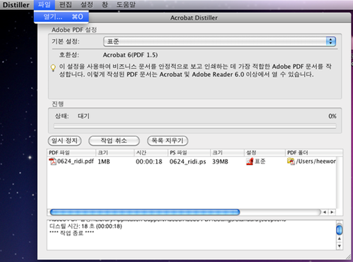
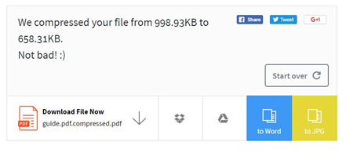
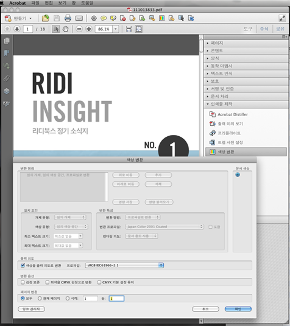
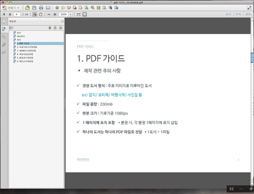
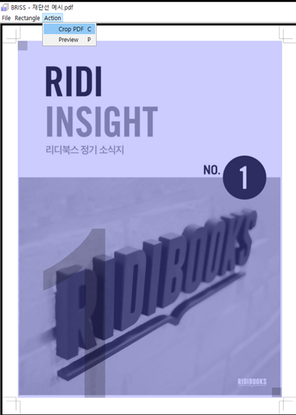

# 서문

## 안내

저희 리디북스는 출판사 여러분께서 제작하여 주신 소중한 PDF 파일을 서비스함에 있어서 자주 발생하는 이슈들을 정리하였습니다.

다른 여러 가지 사례들도 많이 있으나, 가장 빈번하게 발생하는 사례를 준비하였습니다.
귀사의 PDF 파일 제작에 참고가 되셨으면 합니다.

## 권장사항

 제작 관련사항 | 비고
--------|--------
① PDF 제작 권장 도서 형식: 주로 이미지로 구성된 도서 | 잡지/ 요리책/ 여행서적/ 사진집 등
② 파일 용량: 최대 200MB |
③ 판본 크기: 가로 기준 1080px |
④ 첫 페이지에 표지 포함하여 제작 | 분권 시, 각 분권 첫 페이지에 표지 삽입
⑤ 하나의 도서는 하나의 파일로 제작 | 용량이 큰 경우 분할등록 및 분할판매 가능

 기타 참고사항 | 비고
--------|--------
① PDF 형식 도서는 서점 내 미리보기 불가 |
② PDF 내 외부링크(하이퍼링크) 이동은 iOS 뷰어에서만 가능 | - 안드로이드 뷰어/ 리디 페이퍼 미지원 - PPT를 PDF로 변환 시 하이퍼링크 직접 삽입해야 함
③ 고해상도 이미지 삽입 시 뷰어 내 로딩 시간이 길어지는 이슈 있음 | JPEG 2000 형식/ 벡터화 이미지 등

# 파일 다운사이징

 파일 다운사이징 방법 1 | 변환 시간이 짧고 편리
--------|--------
 | 1. Adobe Acrobat X pro 실행 2. 파일 → 다른 이름으로 저장 → 크기가 축소된 PDF 

 파일 다운사이징 방법 2 | 큰 폭으로 다운사이징 가능
--------|--------
  | 1. Adobe Acrobat X pro 실행 2. 파일 → 다른 이름으로 저장 → 기타옵션 → PostScript 3. 확장자 .ps 파일로 저장 4. Adobe Acrobat Distiller 실행 5. 파일 → 열기 → 앞단계에서 저장했던 .ps 파일 불러오기 (열어두었던 PDF창은 종료) 

 파일 다운사이징 방법 3 | 웹에서 간편하게 다운사이징 할 수 있으나, 시간 당 최대 2개의 파일만 작업 가능
--------|--------
  | 1. https://smallpdf.com/compress-pdf 접속 2. PDF 파일 업로드 3. 압축 완료된 파일 다운로드 

# sRGB 모드 변환

1. Acrobat X Pro 실행
2. 도구 → 인쇄물 제작 → 색상변환
3. 출력의도 → ‘색상을 출력 의도로 변환’ 체크 → 프로파일
4. 프로파일 → sRGB IEX61966-2.1 클릭 후 확인 (버전마다 sRGB 코드가 다를 수 있음)

# 책갈피 삽입

1. Adobe Acrobat X Pro 실행
2. 해당 목차 페이지로 이동 후 Ctrl+B 눌러 책갈피 삽입
3. 목차명 기입

# 재단선 삭제

1. http://briss.en.softonic.com/download 접속 → Briss 다운로드 및 설치
2. Briss 실행
3. File → Load file
4. 제외할 페이지 입력 후 확인
5. 재단선 안으로 드래그하여 자를 부분 조절
6. Action → Preview 통해 미리 보기
7. Action → crop PDF 실행

